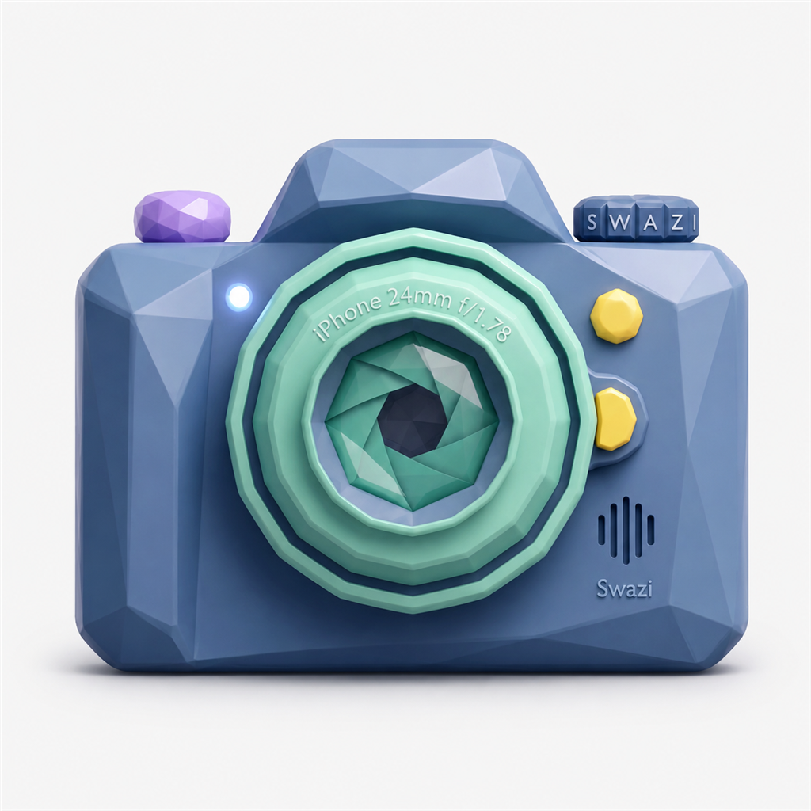

  

<h1 align="center">LowPolyCam</h1>

  <b>A lightweight iOS camera app built for long recordings, low storage use, flexible shooting, and fast camera control.</b> 
  Designed for iOS 26+ and tested primarily on iPhone 11 with iOS 27.

---

## 📸 Overview

**LowPolyCam** is a lightweight camera app focused on giving you more control over recording quality, storage usage, frame rate, codec, photos, Slow-Mo, and long recording sessions.

Choose your resolution, FPS, codec, compression level, camera mode, and Pro Tools settings, then start shooting.

LowPolyCam is designed to stay responsive while avoiding unnecessary camera work in the background.

---

## ✨ Features

### 📸 Photo Mode

**Full-Resolution Photos** — Capture photos using the highest supported resolution for the selected camera. 
**12 MP Support** — Uses up to 12 MP where supported by the camera hardware. 
**HEIC or JPEG** — Choose the photo file format. 
**Aspect Ratios** — Capture using supported photo aspect ratios such as 4:3 and 1:1. 
**Burst Mode** — Capture multiple full-resolution photos quickly. 
**Timer** — Delay photo capture when needed. 
**Tap to Focus** — Tap the viewfinder to focus and expose. 
**AF / AE Lock** — Lock focus and exposure when needed. 
**Unmirrored Selfies** — Save front-camera photos without unwanted mirroring. 
**Save to Photos** — Photos are saved directly to the iOS Photos library.

### 🎥 Video Recording

**Resolutions:** 4K, 1080p, 720p and lower supported recording resolutions 
**Frame Rates:** 24, 30 and 60 FPS where supported 
**Modes:** Video, Photo and Slo-Mo 
**Compression:** High, Medium and Data Saver 
**Codecs:** HEVC or H.264 where supported 
**Zoom:** Smooth continuous zoom across the supported camera range 
**File Splitting:** Optional split recording for long sessions 
**Save to Photos:** Recordings are saved directly to the Photos library 
**Live Recording Stats:** Optional real-time recording information 
**Automatic Compatibility:** Unsupported combinations are automatically rejected or hidden

### 🐌 Slow-Mo

**120 FPS Recording** — High-frame-rate recording on supported cameras. 
**240 FPS Recording** — Rear-camera 240 FPS support on compatible hardware. 
**Camera-Aware FPS Options** — Unsupported frame rates are automatically hidden. 
**Improved HFR Selection** — Slow-Mo now reuses selected camera formats instead of repeatedly scanning hardware. 
**Reliable Recording** — Stronger validation before high-FPS recording begins.

### 🛠 Pro Tools

**Exposure** — Adjust exposure from −2.0 to +2.0 EV. 
**White Balance** — Auto and manual white-balance presets. 
**Focus / Exposure Lock** — Lock AF and AE directly from the viewfinder. 
**Horizon Level** — Gyroscope-based level indicator. 
**Tap Focus** — Quickly focus and expose anywhere in the preview. 
**Haptic Feedback** — Adjustable capture haptics.

---

## 📊 Live Recording Stats

Enable **Live Recording Stats** to display recording information while filming.

Available information includes:

* Live FPS
* Live bitrate / Mbps
* Dropped-frame information
* Recording status

Live Metrics are automatically disabled or detached on camera paths where keeping them active would interfere with stable recording.

---

## 🖥 Camera HUD

The camera HUD can independently display:

* Resolution
* FPS
* Remaining recording time / photo capacity
* White balance
* Battery
* Free storage
* Thermal state
* Dropped-frame information

HUD elements can be enabled or disabled individually.

---

## 🔋 Battery & Longevity

**Longevity Mode** — Reduces unnecessary processing during long recording sessions. 
**Keep Screen Awake** — Prevent the display from sleeping while actively using the camera. 
**Efficient Live Metrics** — Avoids unnecessary output configuration when nothing changed. 
**Reduced Background Work** — Repeated settings, UI updates, and camera requests are ignored where possible. 
**Low-Space Protection** — Prevents recording from continuing when available storage becomes critically low.

---

## 🛡 Recovery & Reliability

LowPolyCam includes multiple protections for long recordings and camera interruptions.

**Recording Recovery** — Failed or interrupted recording files can be retained for recovery. 
**Photos Save Protection** — Pending Photos saves are tracked before temporary files are removed. 
**Camera Recovery** — Camera sessions can recover from interruptions and media-services resets. 
**Rollback Protection** — Failed camera/input changes attempt to restore the previous working configuration. 
**Lifecycle Protection** — Background, inactive and active states are handled separately. 
**Request Generations** — Stale camera operations are rejected before they can overwrite newer settings.

---

## ⚙️ Settings

LowPolyCam uses mode-aware settings so options only appear when they are relevant.

### Video

* Resolution
* FPS
* HEVC / H.264
* High / Medium / Data Saver compression
* Stabilization
* Live Recording Stats
* Split recording

### Photo

* Megapixels
* HEIC / JPEG
* Aspect ratio
* Burst count
* Timer

### Slow-Mo

* Supported resolution
* 120 / 240 FPS where available
* Compression settings
* Camera-specific compatibility

### Viewfinder & HUD

* Camera HUD
* Resolution
* FPS
* Remaining time
* Battery
* Storage
* White balance
* Thermal status
* Level meter
* HUD text size

---

## ⚡ Performance

LowPolyCam v4.2 contains a large camera-performance and reliability pass.

### 🚀 Up to ~60% Faster Photo Capture

Photo capture is **up to approximately 60% faster than v4.1.1** in observed testing.

The shutter becomes available again after the camera finishes the actual capture instead of waiting for slower image processing and Photos saving.

Cropping, resizing and saving continue away from the shutter-critical path.

### ⚙️ Up to ~30% Faster Settings

Settings applying was improved by **up to approximately 30%** during the v4.1 → v4.2 development cycle.

Camera state changes now perform less unnecessary work and are less likely to block the UI.

### 🎥 Faster Video Configuration

A new **70 ms Video configuration coalescer** combines rapid changes to:

* Resolution
* FPS
* Codec
* Compression

Instead of configuring every temporary combination, LowPolyCam moves toward the newest valid setting.

In one device stress test:

**40 Video configuration requests → 23 actual applies + 17 coalesced requests**

That is roughly **42% fewer real configuration applies** during that test.

### 🔭 Much Faster Rear 4K60 Camera Switching

Rear 4K60 camera/lens behaviour was observed on the test device to feel roughly **2× as fast as the previous build**.

This is a user-observed improvement rather than a controlled benchmark.

### ⏺ Faster Repeated Record Starts

High-quality recording now remembers a verified working movie-output configuration.

When the camera configuration has not changed, repeated Record presses can skip a redundant movie-output configuration step.

The safe full configuration path is still used whenever the app cannot prove that the current output is valid.

---

## 🧠 v4.2 Camera Architecture

v4.2 significantly improves how camera work is scheduled.

### Video Configuration Coalescing

Rapid Video settings are combined so intermediate states do not all reach AVFoundation.

### Immutable Configuration Requests

Each accepted Video configuration carries its own:

* Resolution
* FPS
* Codec
* Compression

This prevents an older camera request from accidentally mixing with newer UI settings.

### Format Result Reuse

Video and Slow-Mo reuse already selected camera formats instead of immediately scanning the hardware again.

### Latest-Value Zoom

Zoom uses a latest-value mailbox so every tiny finger movement does not create another queued hardware operation.

### Reduced SwiftUI Work

Derived camera state is only published when values actually change.

### Smarter Codec Checks

Alternate codec support is memoized for the current camera and recording configuration.

---

## 🔧 v4.2 Fixes

### Video / Recording

* Fixed heavy glitching when using **4K60 with Live Recording Stats**
* Fixed the live preview occasionally zooming unexpectedly
* Fixed stale codec/compression configuration races
* Fixed settings from different Video requests becoming mixed together
* Improved repeated start/stop reliability
* Improved recording finalization
* Improved split-record handling
* Improved cancellation while a recording is starting
* Improved Photos save protection
* Improved Recovery save handling
* Improved H.264 / HEVC compatibility checks
* Improved bitrate configuration consistency

### 4K60 / Camera Switching

* Fixed a **4K60 physical-lens handoff freeze**
* Improved 0.5× ↔ 1× camera switching
* Reduced unnecessary camera-format scanning
* Improved preview transition masking
* Improved preview readiness checks
* Safely suspends/restores the torch while physical camera inputs are replaced
* Prevents zoom hardware mutations while the capture session is interrupted
* Preserves rollback if a camera handoff fails

### White Balance / Focus / Exposure

* Fixed a white-balance freeze
* Improved Auto ↔ preset transitions
* Improved manual-WB physical-camera handling
* Improved focus/exposure lock
* Improved tap focus
* Improved exposure request handling
* Improved focus/exposure restoration after camera reconfiguration

### Photo / Burst

* Photo capture up to ~60% faster
* Fixed Burst Mode occasionally getting stuck after releasing
* Improved maximum-resolution still capture
* Fixed aspect-ratio state not matching the saved image
* Improved HEIC/JPEG handling
* Improved photo save races
* Reduced storage checks during Burst capture
* Improved front/rear photo consistency

### Settings / UI

* Settings applying up to ~30% faster in observed testing
* Improved rapid settings changes
* Reduced unnecessary state publishing
* Improved unsupported-option handling
* Improved codec availability messages
* Improved Quick Presets compatibility checks
* Improved HUD state handling
* Improved settings layout and organisation

### Lifecycle / Recovery

* Improved camera interruption handling
* Improved media-services reset recovery
* Improved partial setup failure recovery
* Improved background / foreground handling
* Duplicate lifecycle work is ignored
* Improved torch/UI synchronisation after interruptions
* Improved recording and Photos recovery behaviour

---

## 🧹 Removed / Replaced Since v4.1

v4.2 also removes several older systems that were no longer needed.

Removed or replaced:

* Old volume-button shutter system
* Old Recorded Clips / in-app gallery system
* Old Moon Button
* Old standalone Auto-Dim system
* Old Performance Profile system
* Old SettingStorage wrapper
* Old DebugLog system
* Old RecordingRecoveryJournal
* Old RecordingStatsSystem
* Multiple older camera helper layers that duplicated camera responsibility
* Obsolete preview-proxy flags
* Dead camera helpers and unused parameters

These were replaced with the current:

* CameraManager architecture
* CameraFormatSelector
* LensTransitionCoordinator
* RequestToken / generation protection
* LiveCaptureMetrics
* LiveRecordingStatsState
* CameraRecoveryStore
* AppEventLog
* PhotoAspectProcessor

The final v4.2 source contains substantially less duplicated camera code while adding stronger camera-state protection.

---

## 💾 Storage

Storage usage depends heavily on:

* Resolution
* FPS
* Codec
* Compression mode
* Scene complexity
* Camera hardware

**Data Saver** is designed for long recording sessions where storage usage matters most.

Actual file size is determined from the bitrate used by the selected camera configuration.

---

## 📱 iOS Notes

**iOS 26+ Required** — LowPolyCam currently targets iOS 26 and newer. 
**iOS 27 Tested** — Primary testing is performed on iOS 27. 
**Screen Must Stay Active** — Standard iOS apps cannot continue normal camera recording after being fully suspended in the background. 
**Hardware Varies** — Available lenses, resolutions and frame rates depend on the device. 
**Automatic Compatibility** — Unsupported options are automatically hidden, rejected or adjusted safely.

---
